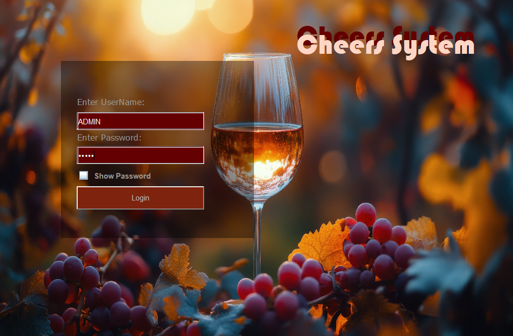
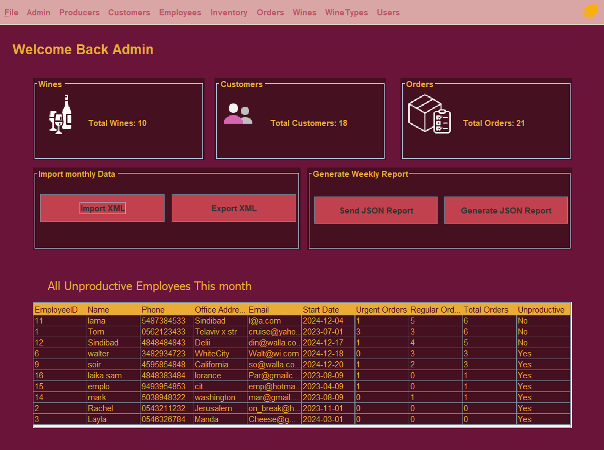
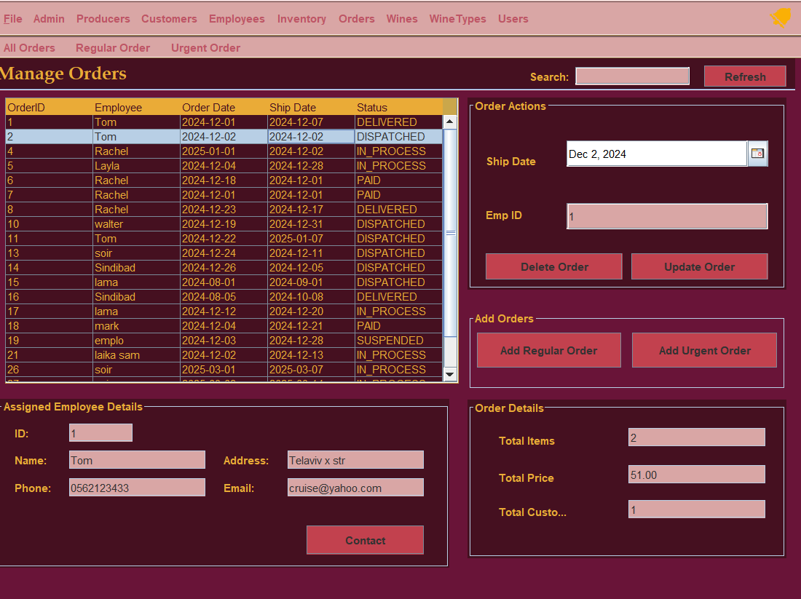
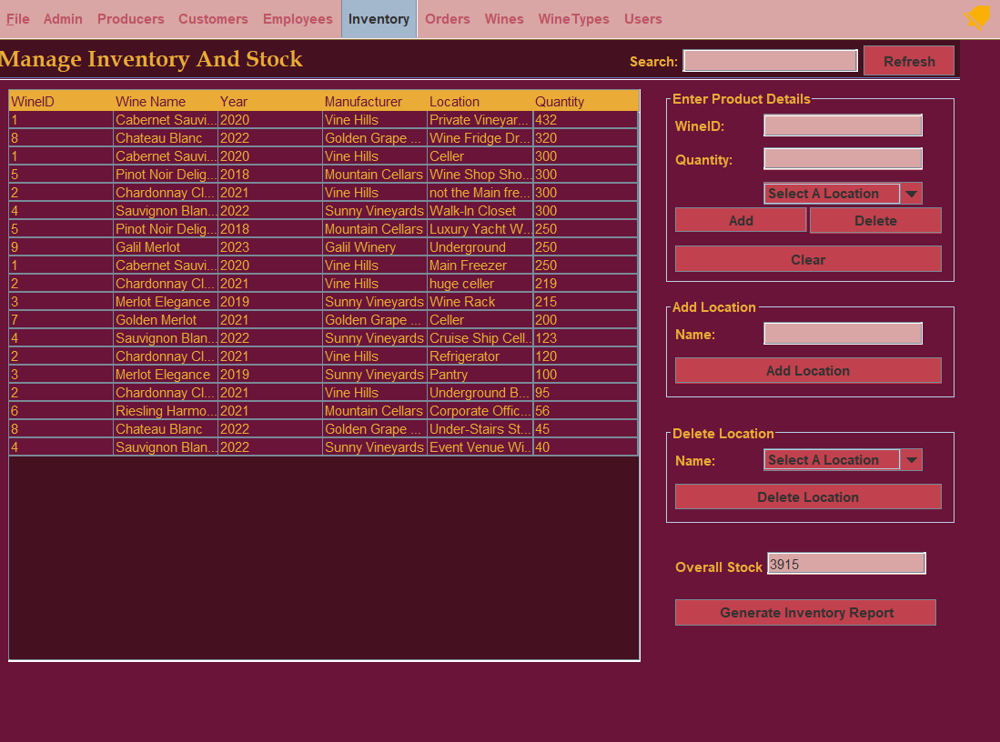

# Winery Management System

## Overview
The Winery Management System is a Java-based desktop application designed to manage winery operations through an interactive graphical user interface.

The system supports managing employees, customers, inventory, orders (regular and urgent), wine types, manufacturers, and business workflows. It integrates with a Microsoft Access database using UCanAccess for persistent data storage and uses JasperReports for generating dynamic reports.

This project demonstrates strong object-oriented design, modular architecture, database integration, and real-world system implementation.

---

## Key Features
- User authentication system (Admin, Sales, Marketing roles)
- Employee and customer management
- Inventory tracking
- Order management (regular and urgent orders)
- Wine and manufacturer management
- Wine recommendation system
- XML data export
- Report generation using JasperReports
- GUI-based navigation using Java Swing

---

## Technologies Used
- Java
- Java Swing (GUI)
- Object-Oriented Programming (OOP)
- Microsoft Access Database (.accdb)
- UCanAccess (JDBC)
- JasperReports
- XML Processing
- External Libraries: JGoodies, MigLayout

---

## System Design & Architecture
The project follows a modular architecture with clear separation of concerns:

- **Boundary Layer** – GUI screens and user interaction
- **Control Layer** – Business logic and system operations
- **Entity Layer** – Core domain models
- **Utility Layer** – Helper classes and tools
- **Enums Layer** – Structured constant values

This structure improves maintainability, readability, and scalability.

---

## Project Structure
```text
src/
├── boundary/         GUI screens
├── control/          Business logic
├── entity/           Core system entities
├── enums/            Enumerations
├── util/             Utility classes
├── xml/              XML data files
├── lib/              External libraries
```

---

## Screenshots

### Login Screen


### Main Dashboard


### Orders Management


### Inventory Management


---

## How to Run
1. Clone or download the repository.
2. Open the project in Eclipse.
3. Add all `.jar` files inside `src/lib` and `src/lib/jasperLib` to the build path.
4. Ensure the database file exists at:
   `src/entity/CheersSystemDatabase.accdb`
5. Run `LoginPage.java` from `src/boundary`.

---

## Project Context
This project was developed as part of the **Design and Implementation of Information Systems** course.

It demonstrates the ability to design and implement a full-scale information system that integrates GUI development, database management, and reporting tools into a cohesive application.

---

## Skills Demonstrated
- Java application development
- Object-oriented system design
- GUI development using Java Swing
- Database integration using JDBC (UCanAccess)
- Report generation using JasperReports
- Modular architecture and separation of concerns
- Data management and XML processing
- Translating business requirements into a working system
